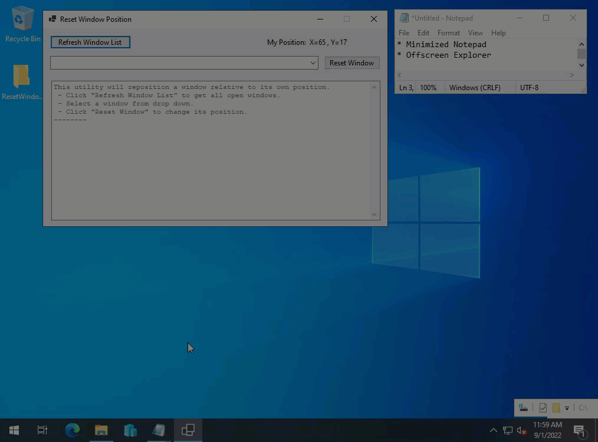

# ResetWindowPosition

A quick and dirty (emphasis on _dirty_) proof of concept to move open windows around. 


Project uses PInvoke to get windows, window positions, and to move them around. 


Currently, it only deals with windows for non-modern apps. Modern apps, which can be suspended and hidden are filtered out. I might add code to handle visible modern apps at a later date.

## Building

Project can be compiled with Visual Studio (tested with VS 2022). Requires dotnet 6.0. 

### Self Contained using CLI

You can create a self-contained output file that can be run on machines without dotnet 6.0 runtime present.

**Windows 10**
   ```
   dotnet publish -r win10-x64  -p:PublishSingleFile=true --self-contained true -c Release
   ```
**Windows Server**
   ```
   dotnet publish -r win-x64  -p:PublishSingleFile=true --self-contained true -c Release
   ```

## Demo



## References
* [Getting a list of all the open windows - Tommy Carlier](https://www.tcx.be/blog/2006/list-open-windows/)
* [Enumerating Windows Using PInvoke - Mark S. Rasmussen](https://improve.dk/enumerating-windows/)
* [dotnet/pinvoke](https://github.com/dotnet/pinvoke)
* [Stackoverflow - EnumWindows returns closed Windows Store applications](https://stackoverflow.com/questions/43927156/enumwindows-returns-closed-windows-store-applications)
